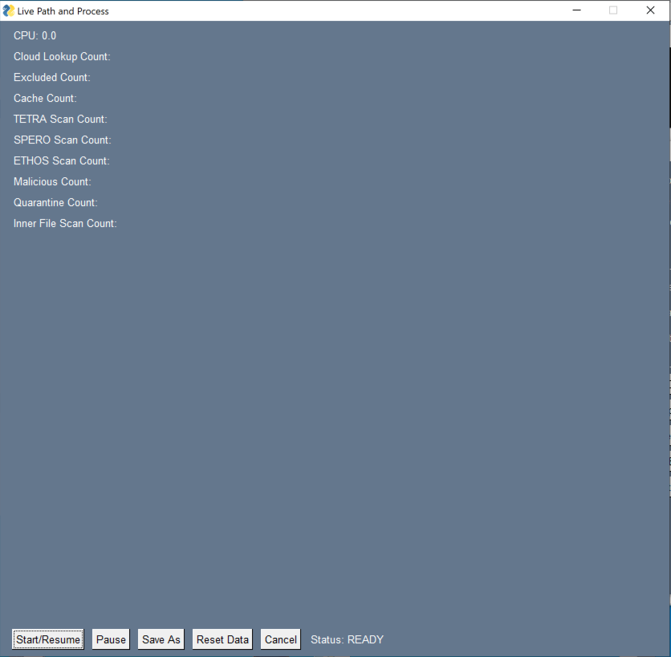
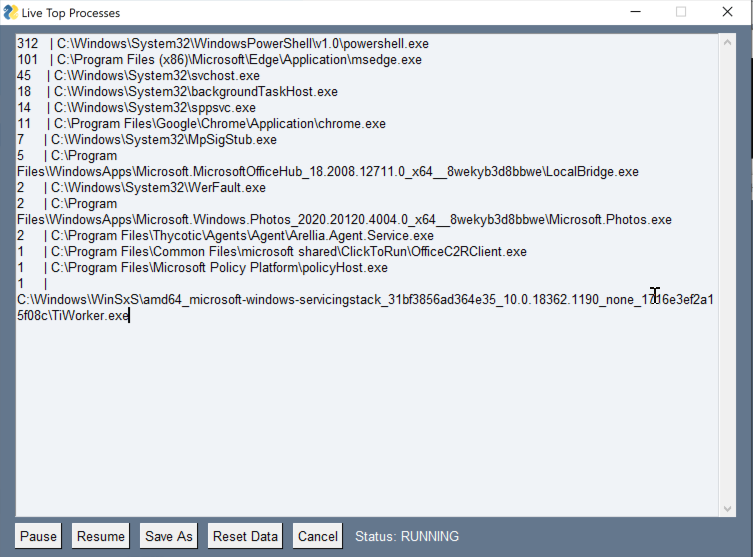
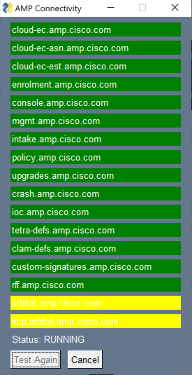
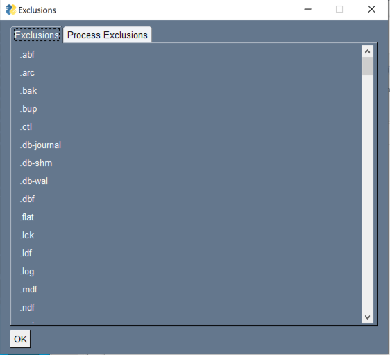
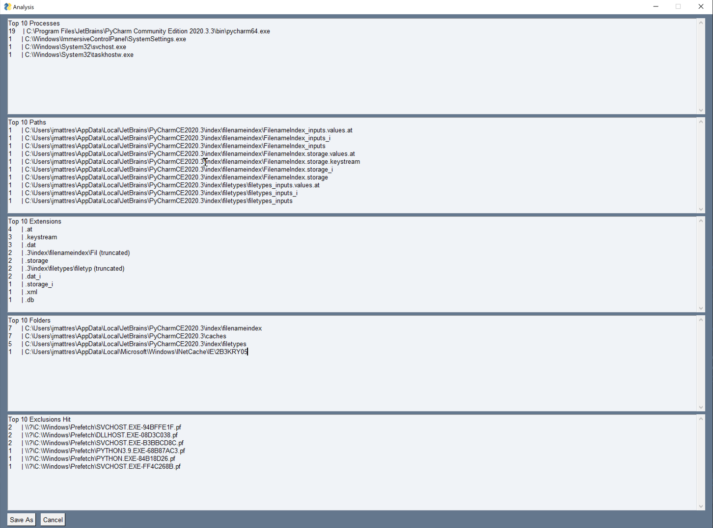
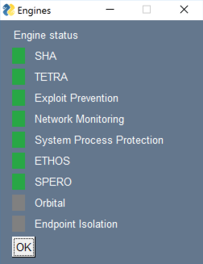
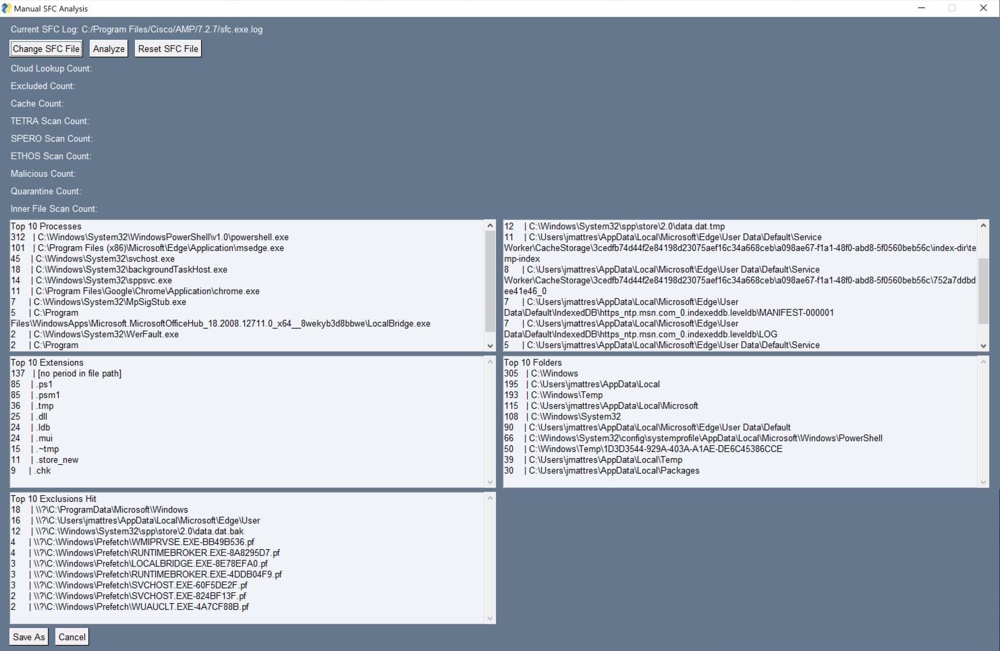

# AMP Health Checker for Windows
 

## Introduction
 
You've successfully deployed AMP for Endpoints and it is now running on your system.  Great!  But, what is it actually doing?  Most of the time it doesn't look like it is doing anything, but AMP is actually performing file checks constantly on the endpoint.  The goal of this tool is to provide additional insight into AMP operations and allow customers to perform troubleshooting on their own.  This should empower customers to self-resolve performance issues that would otherwise involve TAC engagement, and also provide visibility into AMP’s various activities.

This tool was developed by Matthew Franks (AMP Tier3), Brandon Macer (Security CX), Joe Mattress, Clay Wooldridge, and David Pryor.  With enough support and adoption, the long-term hope is to integrate this tool’s functionality into the AMP GUI.

## Disclaimer

This is not an officially supported tool and was developed as a side project, not as an official release by Cisco.  Any support received will be on an as-available timeframe and feature requests may not be fulfilled.

## Installation
 
No installation is required.  The tool can be downloaded or cloned from GitHub.  If you'd like to make an EXE, you can do so with [PyInstaller](https://www.pyinstaller.org/):
> pyinstaller --onefile --noconsole --icon amp-icon.ico .\main_page.py

Current executable has been included in the files above for ease of use.

## Usage
 
To start the tool, ensure that you have an instance of AMP running and run the main_page.py script. If you have an executable from PyInstaller, just right-click the executable and select "Run as Administrator".  You'll be presented with the GUI interface.

 
## Main Page GUI

## Settings GUI

This page is reached by pressing "Settings" button from Main Page GUI.   

There are 4 modes dependent on which cloud your connector belongs to:   

**Private** - custom mode to for private networks  
**NAM** - North American   
**EU** - European  
**APJC** - Asian Pacific  

**AMP Console Hostname** - enter hostname and associated URLs will be prepopulated.

**Policy URL:** used by "Check Policy Version" button on Main Page.  
**Isolation URL:** used by the tool to determine if AMP Endpoint is isolated.  
**Tetra 32bit URL:** used by "Check TETRA Version" button on Main Page if on 32-bit Windows. 
**Tetra 64bit URL:** used by "Check TETRA Version" button on Main Page if on 64-bit Windows. 
**Verify API Creds URL:** used by "Check API Credentials" button on Main Page. 

**Save** The AMP Health Check tool saves configuration settings  
to a json file located at:  %HOME%/.amp_health_check/config.json   

When the tool first starts up, it will check this directory location for config.json.  If not  
present, the tool will start up with default settings.  When the tool closes or if any values  
are changed, the config.json file will be created and/or updated.

**Import** A custom config.json file may be imported using the IMPORT button in the Settings GUI. This is to provide the option to load in a config.json file to be utilized by the tool.  The tool will give the following prompt allowing you to browse to the location of the config.json file you want to import:

Those settings will then get saved to %HOME%/.amp_health_check/config.json  When a json file is imported, the tool will do basic validation to ensure it is in the proper format.  If it is incorrect, you will see the following error:

You may use the tool to create a json template.  Simply launch the tool and then close it.  When the tool starts up, it will check for a json in %HOME%.  If it doesn't exist, it will create one.  That json file can then be edited and used as a template to distribute to users as a config for the tool.

Here is a sample config.json file:

### AMP Version
 
This displays the AMP version that is installed on your system.

### CPU Usage
 
This displays the CPU resources being consumed by the AMP process.

### AMP Uptime
 
This displays the length of time since the AMP process was started/restarted.

### Isolation
 
This displays either Not Isolated or Isolated depending on the current isolation status.

### Isolation Unlock Code
 
If isolated, the Isolation Code to unlock the connector will be displayed.

NOTE: Valid API Credentials are required for this functionality to work.

For additional information on Endpoint Isolation, please refer to the [AMP User Guide](https://docs.amp.cisco.com/en/A4E/AMP%20for%20Endpoints%20User%20Guide.pdf). 

### TETRA Version
 
This displays the current TETRA definition version downloaded by the AMP connector.  Click the Check TETRA Version button to check that against the version available in the cloud.  If you have the latest version, it will be highlighted Green.  If you have a version within the last five updates, it will be highlighted Yellow.  If your version is more than five updates behind, it will be highlighted Red.  When not in sync, the cloud version will be displayed to the right of the button.

NOTE: This functionality does not require API Credentials.

### Policy Serial
 
This displays the current Policy Serial number in place on the **local** AMP connector.  Click the Check Policy Version button to check that against the version available in the cloud.  If you have the latest version, it will be highlighted Green.  If your version is not the latest, it will be highlighted Red.  When not in sync, the latest version available in the cloud will be displayed to the right of the button.

### API Credentials
 
This display will show if you have provided valid API Credentials.  It will show either Valid or Invalid.  There are two ways to provide credentials.

1. Click the Get API Credentials button.  This will show a popup and allow you to supply the Client ID and API Key for authentication.  

2. If you place a file in the same directory as the main_page.py script or AMP Health Checker executable, the program can read the credentials from there to avoid manually supplying them each time.  The file must be called apiCreds.txt and be formatted like this:

> client_id="abcdabcdabcdabcdabcd"

> api_key="abcd1234-abcd-1234-abcd-1234abcd1234"

 
### Live Debugging
 
The Live Debugging button will bring you to a new popup.  Within this popup, you can conduct performance troubleshooting.  The statistics provided should give you an indication of the engine or action that is causing high system resource utilization.

To start, press the Start/Resume button.  To pause, press Pause.  To resume again, press Start/Resume.  If you would like to save the scanned files to a text file, click Save As to save it locally on your system.  Click Reset Data to reset the counters.  Click Cancel to exit.

### Live Top Processes
 
Live top processes gives a quick view into the top processes being scanned by the AMP Connector.  The controls are similar to the Live Debugging controls.

 

### Connectivity Test
 
The Connectivity Test button will allow you to run a connectivity test to the AMP servers.  They will all show as yellow while the test is running.  **Green** - connection successful.  **Orange** - server reached, but something went wrong (i.e. cert error).  **Red** - connection timeout (i.e. endpoint unreachable).

NOTE: This does not validate whether or not traffic was altered on the way to the servers, so please be sure to bypass these addresses through your proxies.

### View Exclusions
 
The View Exclusions button allows you to view the path and process exclusions from the current policy on the endpoint.

 

### Generate Diagnostic
 
The Generate Diagnostic button allows you to generate an AMP Diagnostic bundle.  This will place the zipped file on your desktop.  It will also create an amp_health_checker_log.log file in the directory with the Health Checker scripts or executable.  If you have an issue with the tool itself, please click the DEBUG button on the main page, recreate the issue, and provide the AMP diagnostic and the Health Checker log for analysis.

### Run Analysis
 
The Run Analysis button will give you a quick snapshot of the system based on the AMP sfc.exe.log files.  The top 10 processes, files, extensions and folders scanned will be displayed.

 

NOTE:  The logs need to be in debug to show the appropriate data.

### Top IPs
 
The Top IPs will show a list of the top ten IP addresses reached out to from files scanned by the AMP Connector.

### Check Engines
 
The Check Engines button will show each engine and whether or not it is enabled in the local policy.  In the example below, Orbital is the only engine not enabled.

 

### Manual SFC Analysis
 
Manual SFC Analysis allows you to run analysis on a file from another machine or an old file from the same machine.  The sfc.exe.log file from the local machine is selected by default but you can change this with the Change SFC File button.  Click Analyze to run the analysis.  Click Reset SFC File to reset the file back to the local sfc.exe.log file.

 

### Log Level
 
The log level buttons allow you to select the logging level for the AMP Health Checker tool.  It does not change the log level on the AMP Connector!  If you run into an issue with the Health Checker tool, please put the tool in DEBUG, reproduce the issue, and provide the AMP diagnostic file and Health Checker logs for analysis.

### Refresh
 
Refresh will refresh the data on the main page.  This may be necessary if the Isolation Status changes while running the Health Checker or if you change Regions.  This feature was introduced to prevent excessive resource utilization by the tool.

### Cancel
 
Cancel will exit the program.
